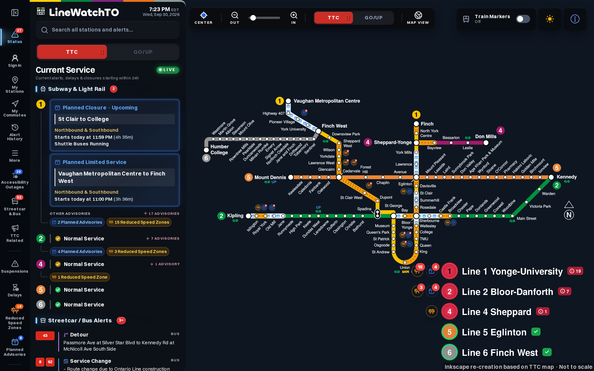
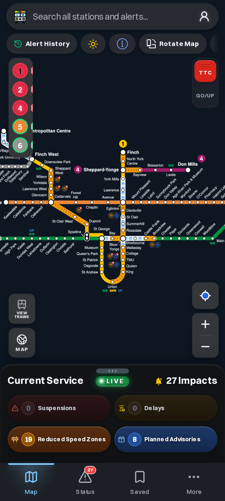
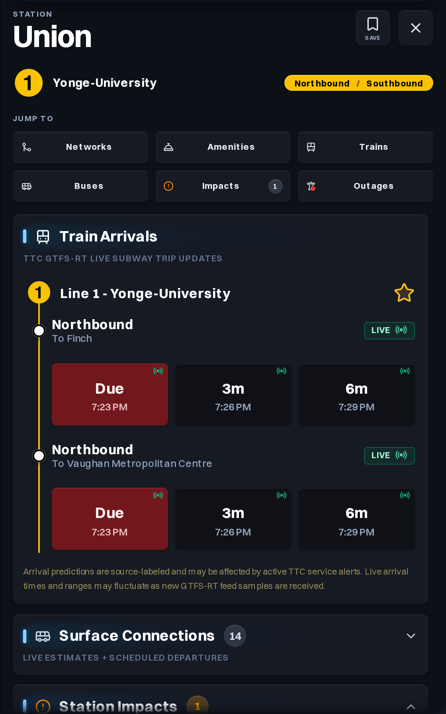
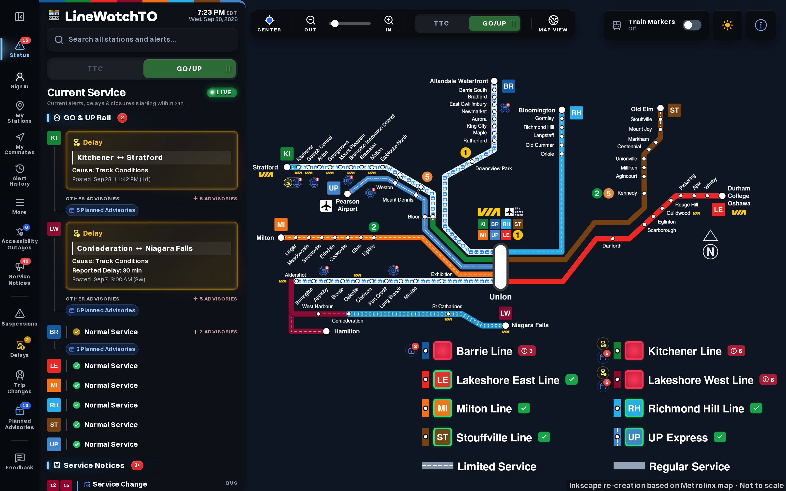
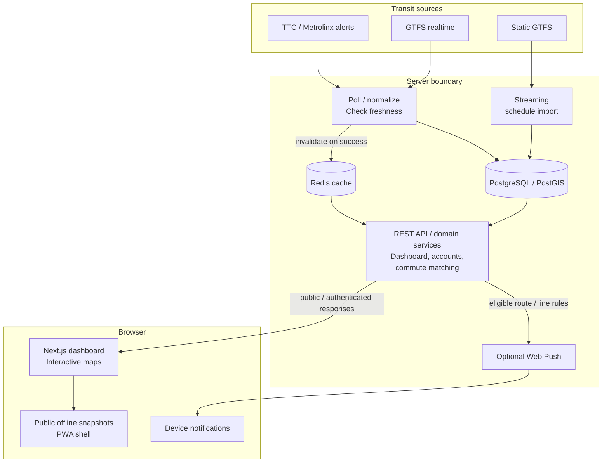
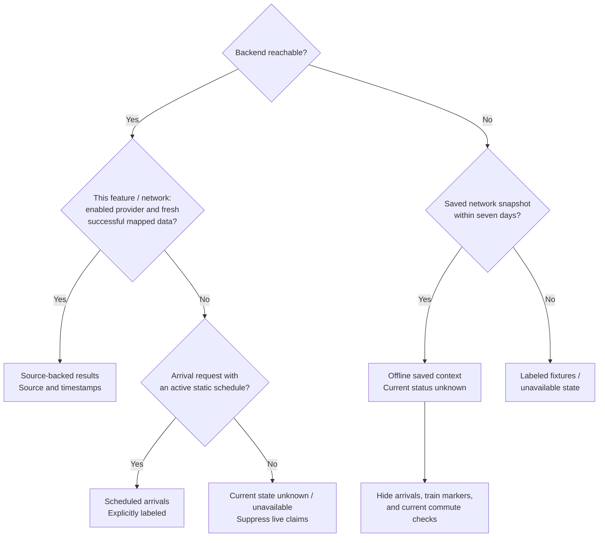

# LineWatchTO

**Is my route affected now, later today, or this weekend?**

LineWatchTO is an unofficial transit dashboard for Toronto's TTC subway/LRT and GO/UP rail networks. It brings service disruptions, planned advisories, station information, and saved commute checks into a map you can use on desktop or your phone. Built and maintained as a personal full-stack project, it serves riders who want to understand how a disruption affects their usual route.

**[Open the dashboard](https://linewatchto.ca)** · [Run locally](#run-locally) · [Architecture](#architecture) · [Contributing](CONTRIBUTING.md)

[](docs/assets/ttc-desktop.png)

*Captured from [linewatchto.ca](https://linewatchto.ca) on September 30, 2026 at 7:23 p.m. EDT, with fresh TTC service data. Screenshots are dated snapshots; open the dashboard for current conditions. Click any image to view it at full resolution.*

## What riders can do

| Rider question | What the dashboard provides |
| --- | --- |
| Where is service affected? | TTC and GO/UP schematic maps, a geographic map option, and direction-aware disruption overlays. |
| Will it affect my usual route? | **My Commutes** matches disruptions to saved routes, with separate outbound/return legs and optional Web Push rules. |
| What is happening at my station? | Station details, source-labeled live or scheduled arrivals, surface connections, accessibility outages, and **My Stations** bookmarks. |
| What is coming up? | Planned advisories, searchable service notices, and station-specific information. |
| What has happened over time? | Alert lifecycle history and disruption analytics with coverage and confidence boundaries. |

<table>
  <tr>
    <th>Phone dashboard</th>
    <th>Union station and live arrivals</th>
  </tr>
  <tr>
    <td><a href="docs/assets/ttc-mobile.png"></a></td>
    <td><a href="docs/assets/station-details.png"></a></td>
  </tr>
</table>

*Public production views captured during the same session, without an account. The station detail is a deliberate close-up; the desktop overviews show the full network. Arrival predictions and scheduled departures retain their source labels.*

<details>
<summary>See the GO/UP regional rail dashboard</summary>

[](docs/assets/regional-desktop.png)

*Captured at 7:23 p.m. EDT with fresh regional service data. TTC and regional source availability were checked independently.*

</details>

## Engineering decisions

The difficult part is turning several feeds into a consistent rider experience while keeping uncertainty visible.

| Problem | Implementation and tradeoff |
| --- | --- |
| A healthy feed can coexist with a failed one. | [Independent source and feature gates](docs/domain-invariants.md#sources-freshness-and-offline-reads) keep TTC, regional alerts, arrivals, schedules, and train markers from borrowing each other's live status. |
| A closure on a line may miss a rider's route or direction. | [Weighted path calculation](backend/src/main/java/com/calebhabesh/linewatch/commute/CommutePathService.java) and [segment/direction matching](backend/src/main/java/com/calebhabesh/linewatch/commute/CommuteImpactService.java) evaluate each commute leg. The feature monitors routes within one network; it does not recommend detours or plan cross-network journeys. |
| Large schedule archives can overwhelm a small server. | The [GTFS importer](backend/src/main/java/com/calebhabesh/linewatch/arrival/schedule/GtfsScheduleImportService.java) streams input and [batches stop-time writes](backend/src/main/java/com/calebhabesh/linewatch/arrival/schedule/GtfsScheduleImportWriter.java), rather than keeping the complete feed in memory. |
| Detailed SVG maps are expensive to redraw during gestures. | [Pre-rendered map planes](docs/map-asset-preparation.md) carry static artwork while React overlays handle changing impacts and selections. Geographic mode uses MapLibre GL JS and OpenFreeMap. |
| A saved dashboard can look live after connectivity fails. | [Separate public snapshots](frontend/src/app/dashboard-snapshot.ts) retain each network for up to seven days, label saved context, and make current status unknown. The [service worker](frontend/public/sw.js) excludes API responses and account pages from its offline cache. |

## Architecture



Provider credentials and retained raw source records stay on the server. Public responses expose normalized rider information; authenticated features use session cookies. Operator endpoints are disabled by default and blocked at the production edge.

| Layer | Technologies |
| --- | --- |
| Web | Next.js App Router, React, TypeScript, Tailwind CSS, MapLibre GL JS |
| API | Java 21, Spring Boot 4.1, Spring Data JPA / Hibernate Spatial, Flyway |
| Storage | PostgreSQL with PostGIS, Redis |
| Delivery | Docker Compose, ARM64 container images, Caddy |
| Verification | Node test runner, Playwright, Maven, GitHub Actions |

Exact dependency versions live in [frontend/package.json](frontend/package.json), [frontend/package-lock.json](frontend/package-lock.json), and [backend/pom.xml](backend/pom.xml).

## How data states are chosen



Fresh alerts do not establish live arrivals or train positions. Estimated train markers are conservative schematic placements, not physical GPS tracking, and are omitted from geographic mode. Surface notices and accessibility outages do not become rail disruption overlays or commute impacts. See the [domain invariants](docs/domain-invariants.md) for the exact boundaries.

## Run locally

### Dashboard demo

Use Node.js 24 LTS and npm. No database, backend, account, or provider key is needed to explore the map and fixture fallback.

```bash
npm --prefix frontend ci
npm --prefix frontend run dev
```

Open [localhost:3000](http://localhost:3000). Without a backend, current service is unknown and demo data is labeled. Account persistence, live arrivals, and push delivery require their configured backend services.

### Full stack

You also need Java 21, Maven 3.9+, and Docker Compose. The checked-in [.env.example](.env.example) contains local defaults and empty or placeholder provider credentials.

```bash
cp .env.example .env
docker compose up -d postgres redis
mvn -f backend/pom.xml spring-boot:run
```

In another terminal, run `npm --prefix frontend run dev`. Alert ingestion is disabled by default. For opt-in live development, use `scripts/dev-live-backend.sh`; keep provider credentials in ignored local environment files. See the [operations guide](docs/operations-guide.md) for source configuration and isolated alert scenarios.

## Verification

```bash
npm --prefix frontend run test:fast
npm --prefix frontend run typecheck
npm --prefix frontend run lint
mvn -f backend/pom.xml test
```

The [testing guide](docs/testing.md) describes browser smoke, offline, map-fit, lifecycle, and release gates. Test counts and timings depend on the checkout and environment; a historical passing run is not a claim that the current checkout has been verified.

## Repository and documentation

```text
frontend/  Dashboard, maps, typed fixtures, PWA, web tests
backend/   REST API, source ingestion, schedules, accounts, persistence, API tests
mobile/    Reserved native workspace; no native app yet
docs/      Domain rules, architecture references, runbooks, publication evidence
scripts/   Development scenarios, data/asset tooling, operational commands
infra/     Optional infrastructure configuration
```

| Start here | Purpose |
| --- | --- |
| [Contributing](CONTRIBUTING.md) / [agent guide](AGENTS.md) | Local workflow, safe fixtures, ownership, and proportional checks |
| [Domain invariants](docs/domain-invariants.md) / [feature reference](docs/feature-reference.md) | Behavior and source boundaries |
| [Operations](docs/operations-guide.md) / [script inventory](docs/script-inventory.md) | Setup variants, scenarios, deployment, and tooling |
| [Security policy](SECURITY.md) / [publication audit](docs/publication-audit-2026-09-30.md) | Private reporting and the scope of the latest repository audit |
| [Source launch gates](docs/source-licensing-launch-gates.md) | Source, map, and naming approval requirements |

## License and attribution

Project code and original documentation are licensed under [MIT](LICENSE). This code license does not grant rights to third-party transit data, adapted map artwork, names, or marks. Bundled fonts retain their [own license notices](frontend/public/assets/fonts/README.md).

LineWatchTO is independent and unofficial. It is not affiliated with, endorsed by, or operated by TTC or Metrolinx. The project author drew the schematic maps in Inkscape, using the [TTC route map](https://www.ttc.ca/routes-and-schedules/1/0) and [Metrolinx GO system map](https://assets.metrolinx.com/image/upload/v1695737837/Images/GO/system-map.png) as visual references. See [credits and third-party notices](THIRD_PARTY_NOTICES.md).

Contains information licensed under the Open Government Licence – Toronto.

That attribution applies to identified City of Toronto open-data inputs, including TTC GTFS Realtime. TTC Live Alerts, TTC website material, and Metrolinx API records have separate [source terms](docs/source-licensing-launch-gates.md). Committed alert examples are synthetic; provider credentials and downloaded source responses stay outside Git.
