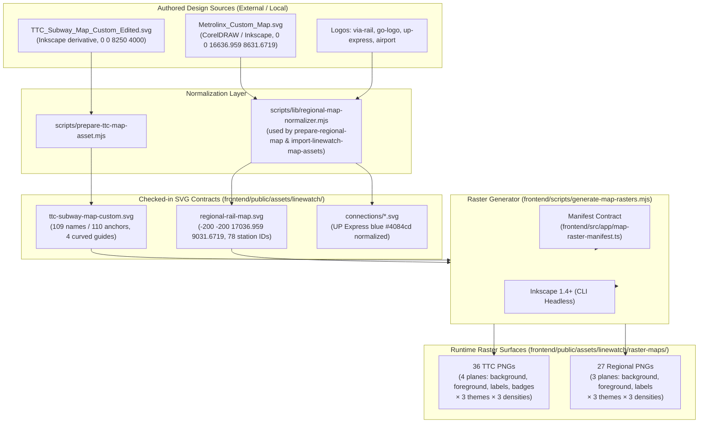

# Map Asset Preparation and Raster Generation Pipeline

This guide documents the asset pipeline, normalization workflows, required dependencies, commands, and output ownership for LineWatchTO map assets.

---

## Architecture and Asset Flow



---

## 1. System Requirements & Required Dependencies

To execute the map normalization and raster generation scripts locally:

1. **Node.js**: v20+ (supports modern ESM and Node test runner).
2. **Inkscape**: v1.4+ CLI (must be on system PATH as `inkscape`).
   ```bash
   inkscape --version # Expected: Inkscape 1.4+
   ```
3. **Typography (Fonts)**:
   - **TeX Gyre Heros** (`regular` and `bold` weights) must be installed locally on the host system so Inkscape can render SVG `<text>` elements into crisp raster label planes matching web rendering.
   - On Linux systems:
     ```bash
     fc-list : family | grep -i "TeX Gyre Heros"
     ```
   - For web runtime delivery, self-hosted WOFF2 fonts are stored under `frontend/public/assets/fonts/texgyreheros-regular.woff2` and `texgyreheros-bold.woff2`.

---

## 2. Source Availability and Checked-in Asset Policy

> [!NOTE]
> **Source Availability and Permissions**:
> Raw authoring vector sources (`TTC_Subway_Map_Custom_Edited.svg`, `Metrolinx_Custom_Map.svg`) are independent authoring design files created by the author and may not be checked into public version control.
>
> However, **all normalized SVG assets and generated raster planes are checked into version control**. Public builds, continuous integration pipelines, and local development do **not** require private authoring directories. The checked-in files in `frontend/public/assets/linewatch/` are canonical and complete.

---

## 3. Normalization CLIs and Commands

### A. Regional Rail Normalization

Regional normalization is powered by the pure library function [`normalizeRegionalMapSvg`](../scripts/lib/regional-map-normalizer.mjs):
- Expands authoring `0 0 16636.959 8631.6719` viewBox by 200px padding to `-200 -200 17036.959 9031.6719`.
- Strictly validates 78 station and junction elements (72 logical stations + 6 junction anchors).
- Enforces contract layer IDs: `regional-lakes-layer`, `regional-lines-layer`, `regional-stations-layer`, `regional-station-labels-layer`, `regional-route-labels-layer`.
- Enforces route IDs: `regional-route-br-path`, `ki`, `up`, `mi`, `rh`, `st`, `le`, `lw-main-path`, `lw-branch-path`, `lw-div`.
- Renames legacy patterns (`service-pattern-stouffville-limited`, `up-accent-pattern`).
- Injects `<g id="regional-segment-guides-layer" style="display:none" />`.
- Hides lakes layer with `display:none`.
- Verifies zero duplicate DOM IDs across the entire SVG.

**CLI Usage**:
```bash
node scripts/prepare-regional-map.mjs <source.svg> [output.svg]
```
Or via environment variables:
```bash
LINEWATCH_REGIONAL_MAP_SOURCE="/path/to/Metrolinx_Custom_Map.svg" node scripts/prepare-regional-map.mjs
# or
LINEWATCH_MAP_SOURCE_DIR="/path/to/authoring/maps" node scripts/prepare-regional-map.mjs
```

### B. TTC Subway Normalization

```bash
node scripts/prepare-ttc-map-asset.mjs <source.svg> <output.svg>
```
- Preserves `viewBox="0 0 8250 4000"`.
- Validates 109 station text labels and 110 visual anchors (Spadina has two visual anchors: `spadina-1` and `spadina-2`).
- Preserves intentional spelling IDs: `station-greenwoood` and `station-o_connor`.
- Preserves 4 non-linear curved centerline guides:
  - `seg-line-1-st-andrew-union`
  - `seg-line-1-union-king`
  - `seg-line-1-st-george-spadina`
  - `seg-line-6-humber-college-westmore`
- Assigns UP Express blue `#4084cd` to UP elements.

### C. Bulk Import

```bash
node scripts/import-linewatch-map-assets.mjs <source-directory> [airport-source.svg]
```
Or via environment variable:
```bash
LINEWATCH_MAP_SOURCE_DIR="/path/to/authoring/maps" node scripts/import-linewatch-map-assets.mjs
```

---

## 4. Raster Generation

Raster generation is driven by [`frontend/scripts/generate-map-rasters.mjs`](../frontend/scripts/generate-map-rasters.mjs) and the shared manifest [`frontend/src/app/map-raster-manifest.ts`](../frontend/src/app/map-raster-manifest.ts).

### Raster Matrix

| Network | Planes | Themes | Densities | Total Variants |
| --- | --- | --- | --- | --- |
| **TTC** | `background`, `foreground`, `labels`, `badges` (4) | `light`, `dark`, `high-contrast` (3) | `mobile`, `balanced`, `desktop` (3) | **36 PNGs** |
| **Regional** | `background`, `foreground`, `labels` (3) | `light`, `dark`, `high-contrast` (3) | `mobile`, `balanced`, `desktop` (3) | **27 PNGs** |
| **Total** | | | | **63 PNGs** |

> [!IMPORTANT]
> Regional does **not** have a `badges` raster plane. Its line badges/labels are handled in `foreground` and SVG overlays. The TypeScript runtime type system enforces this via discriminated unions (`RasterMapPlaneFor<"regional">`), preventing 404 requests for non-existent variants.

### Commands

Generate all 63 raster variants:
```bash
npm --prefix frontend run generate:map-rasters
```

Generate only a specific density (e.g. for rapid local iteration):
```bash
node frontend/scripts/generate-map-rasters.mjs --density=mobile
# or
node frontend/scripts/generate-map-rasters.mjs --density=balanced
# or
node frontend/scripts/generate-map-rasters.mjs --density=desktop
```

---

## 5. Output Ownership

- **`frontend/public/assets/linewatch/raster-maps/*.png`**:
  - These files are **generated build outputs**, owned strictly by `generate:map-rasters`.
  - **Never hand-edit raster files**. Any visual adjustments must be made in the source SVG or CSS raster export overrides inside `generate-map-rasters.mjs`.
- **`frontend/public/assets/linewatch/*.svg`**:
  - Normalized SVG assets checked into Git for deployment and browser hydration.
  - Sourced and normalized from authoring files via the preparation CLIs.
